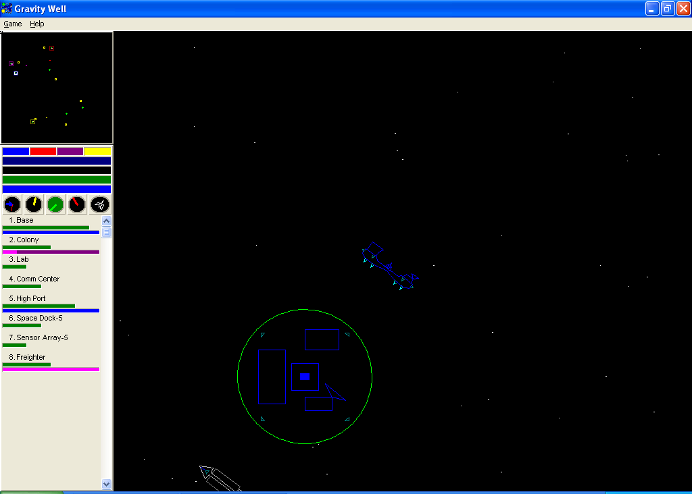
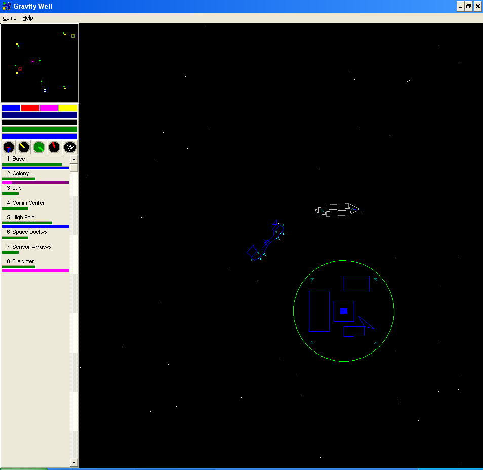

# Reference Material: Original Gravity Well (1995)

*Gravity Well* is a Windows 95/NT game by **Software Engineering, Inc.** (© 1995–1998). It's a real-time game of planetary conquest that plays like an arcade game: you fly one fighter, with Newtonian thrust and gravity, around a star sector. You claim planets by landing on them, and an automated economy of freighters, bases and colonies follows behind you.

Start with **[game-mechanics.md](game-mechanics.md)**, a one-page digest of every rule and number in the manual.

## Contents

| Path | What it is |
|------|------------|
| [game-mechanics.md](game-mechanics.md) | Digest of rules, units, numbers, controls and economy, with links back to the manual |
| [manual-md/](manual-md/table%20of%20contents.md) | The original help manual converted to Markdown (searchable, linkable) |
| [manual/](manual/table%20of%20contents.html) | Archived copy of the original HTML help and its images, unchanged |
| [screenshots/](screenshots/) | In-game screenshots from the Internet Archive |

### Manual chapters

1. [Installation](manual-md/Installation.md)
2. [Getting A Fast Start](manual-md/Getting%20A%20Fast%20Start.md): tutorial walkthrough
3. [Control Summary](manual-md/Control%20Summary.md): keyboard and mouse
4. [Game Setup](manual-md/game%20setup.md): new-game options, AI personalities, menu
5. [Playing The Game](manual-md/Playing%20The%20Game.md): objective, landing, HUD, radar, ship list
6. [The Machines Of War](manual-md/The%20Machines%20Of%20War.md): the 9 unit types
7. [Technological Developments](manual-md/technological%20developments.md): weapons, shields, upgrades
8. [Economic Model](manual-md/Economic%20Model.md): raw/finished materials flow
9. [Multiplayer Game](manual-md/multiplayer%20game.md): planned, never shipped
10. [Licensing And Passwords](manual-md/licensing%20and%20passwords.md), [Purchasing A License](manual-md/purchasing%20a%20license.md), [Software Engineering, Inc.](manual-md/sei.md), [Copyright Information](manual-md/copyright%20information.md)

## Screenshots

Both screenshots show the same layout: the radar on the top left; below it the opponent boxes, status bars and five round gauges; then the scrollable ship list; and the main view window on the right. The vector-style graphics are visible: a home planet ringed in green with base, colony and tech-center rectangles, a fighter squadron, and a freighter.

| v3.5 (32-bit) | v3.5 (16-bit) |
|---|---|
|  |  |

## Sources

| Source | URL | Retrieved |
|--------|-----|-----------|
| Original help manual (v4.x), mirrored on bettiesart.com | http://www.bettiesart.com/tc/terracolony/gw4help/table%20of%20contents.html | 2026-10-09 |
| Internet Archive: *Gravity Well v3.5 (32 bit)* | https://archive.org/details/GWELL35X | 2026-10-09 |
| Internet Archive: *Gravity Well v3.5* | https://archive.org/details/GWELL35 | 2026-10-09 |

The Internet Archive items also hold the original game binaries (`GWELL35X.zip`, `GWELL35.zip`). We deliberately **do not** store them in this repo. Download them from the links above if you need to compare behaviour against the original running under emulation or a VM.

Note: the manual describes **v4.x**, while the screenshots show **v3.5**. Small differences between the two are possible (for example, the manual says shareware builds lock some weapons until you buy a license).

## Copyright

The manual text and images are © 1995–1998 Software Engineering, Inc., all rights reserved. They are kept here only as research reference for building a compatible clone. They are **not** covered by this repository's GPL-2.0 license, and the clone must not ship them as game assets.
